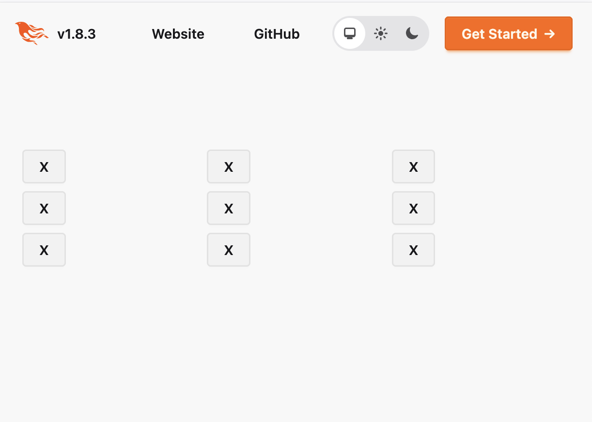

Ik begon een half jaar geleden bij YipYip als [Elixir](https://elixir-lang.org/) ontwikkelaar. Daarvoor werkte ik met [F#](https://fsharp.org/) en [SAFE stack](https://safe-stack.github.io/), en had ik weinig ervaring met Elixir, en geen ervaring met [Phoenix](https://www.phoenixframework.org/), het framework waarin we backends bouwen.

Om meer te leren over het Phoenix framework, het werken met data in het geheugen en het managen van processen, schreef ik een poosje geleden een simpel boter, kaas en eieren spel als Phoenix LiveView app. In deze serie neem ik je mee in het bouwen van deze app in 3 fasen, waarin in iedere fase een nieuw concept uitgewerkt wordt.

Fase 1: het spel als lokale multiplayer. Hiermee leren we de basis van het Phoenix framework
Fase 2: het spel als online multiplayer. Hiermee leren we hoe we met een GenServer te werken en communiceren tussen verschillende processen.
Fase 3: het ondersteunen van meerdere game-sessies binnen de server. Zo leren we over Registries.

In deze eerste versie van de app spelen beide spelers op hetzelfde scherm (lokale multiplayer). Omdat we met Phoenix werken, gaat iedere actie wel terug naar de server, en vindt de logica daar plaats! Dit voelt misschien wat gek, maar er zijn zeker wat voordelen aan deze manier van werken.

* Voor zware operaties ben je niet afhankelijk van de performance van het apparaat waarop de website gebruikt wordt
* De server is een "vertrouwde plek"; als ontwikkelaar moet je altijd voorzichtig zijn met data en operaties die in de browser uitgevoerd worden; een gebruiker of zelfs een derde partij kunnen vrij makkelijk data of logica in de browser manipuleren; zolang je server niet gehackt wordt, weet je dat wat daar gebeurt precies is zoals je het zelf hebt geschreven.
* Doordat je logica laat plaatsvinden op de server, kunnen we van onze vertrouwde backend taal gebruik maken. Dat maakt het makkelijk om logica te hergebruiken. Je zou er natuurlijk ook voor kunnen kiezen om via Node gebruik te maken van Javascript op de server. Waarom we graag gebruik maken van Elixir lees je [hier](https://www.yipyip.nl/expertise/elixir-ontwikkelaar).

Je kunt de versie van de game zoals hij is op het einde van deze demo vinden in [deze commit](https://github.com/jkaptein-lgtm/tic_tac_toe_demo/commit/6ab2a6c3cb31b5f6c52ce1c9f9827dbe28e92354)

## Het opzetten van een nieuw project

Als je [Elixir](https://elixir-lang.org/install.html) en [Phoenix](https://hexdocs.pm/phoenix/installation.html) geïnstalleerd hebt, is het starten van een nieuw project simpel. Omdat de hele game in het geheugen draait, hebben we geen database nodig. We gebruiken daarom de `--no-ecto` flag; dit zorgt ervoor dat er geen setup wordt gedaan voor een database.

```bash
mix phx.new tic_tac_toe --no-ecto
mix deps.get
```

Vervolgens kan je de server starten:

```bash
joostkaptein@MacBookPro tic_tac_toe % mix phx.server
[info] Running TicTacToeWeb.Endpoint with Bandit 1.8.0 at 0.0.0.0:4000 (http)
[info] Access TicTacToeWeb.Endpoint at http://localhost:4000
```

## De logica van het spel

Iedereen kent boter, kaas en eieren. De logica is niet zo spannend; maak een nieuwe module aan in `lib/tic_tac_toe/game.ex`, met de volgende inhoud:

```elixir
defmodule TicTacToe.Game do
  @moduledoc """
  Contains the core game logic for the TicTacToe game.
  """

  @doc """
  Creates an empty board to play the game on

  ## Examples

      iex> empty_board()
      [
        nil, nil, nil,
        nil, nil, nil,
        nil, nil, nil
      ]
  """
  def empty_board do
    for _row <- 0..8, do: nil
  end

  @doc """
  returns the outcome of the game if the game is decided, otherwise returns nil

  ## Examples

      iex> result?([
      ...>   :x, :x, :x,
      ...>   :o, nil, nil,
      ...>   :o, :o, nil
      ...> ])
      {:win, :x}

      iex> result?(empty_board())
      nil

      iex> result?([
      ...>   :x, :o, :x,
      ...>   :x, :x, :o,
      ...>   :o, :x, :o
      ...> ])
      :draw
  """
  def result?(board) do
    case winner(board) do
      nil ->
        if Enum.all?(board) do
          :draw
        else
          nil
        end

      winner ->
        {:win, winner}
    end
  end

  defp winner(board) do
    cols = board |> Enum.chunk_every(3)
    r1 = board |> Enum.take_every(3)
    r2 = board |> Enum.drop(1) |> Enum.take_every(3)
    r3 = board |> Enum.drop(2) |> Enum.take_every(3)
    diag1 = [board |> Enum.at(0), board |> Enum.at(4), board |> Enum.at(8)]
    diag2 = [board |> Enum.at(2), board |> Enum.at(4), board |> Enum.at(6)]

    lines =
      cols ++
        [
          r1,
          r2,
          r3,
          diag1,
          diag2
        ]

    Enum.find_value(lines, fn
      [:x, :x, :x] -> :x
      [:o, :o, :o] -> :o
      _ -> nil
    end)
  end

  @doc """
  Claims a position for the player at play

  ## Examples

      iex> board = [
      ...>   :x, :x, nil,
      ...>   :o, nil, nil,
      ...>   :o, :o, nil
      ...> ]
      iex> board |> choose(2)
      {:ok, [
        :x, :x, :x,
        :o, nil, nil,
        :o, :o, nil
      ]}
      iex> board |> choose(3)
      :error
  """
  def choose(board, choice) do
    case Enum.at(board, choice) do
      nil -> {:ok, List.update_at(board, choice, fn _ -> active_player(board) end)}
      _ -> :error
    end
  end

  @doc """
  Returns the player that's currently at play; :x always starts

  ## Examples

      iex> active_player(empty_board())
      :x

      iex> board = [
      ...>   :x, :x, nil,
      ...>   :o, :x, :x,
      ...>   :o, :o, nil
      ...> ]
      iex> active_player(board)
      :o

  """
  def active_player(board) do
    xs = Enum.count(board, fn v -> v == :x end)
    os = Enum.count(board, fn v -> v == :o end)

    if xs > os do
      :o
    else
      :x
    end
  end
end
```

## Het bord weergeven

Vervolgens gaan we de pagina maken waarop je het spel speelt; een LiveView pagina bestaat uit 1 bestand in de `..._web` map. Maak het volgende bestand aan: `lib/tic_tac_toe_web/game_live.ex`.

```
defmodule TicTacToeWeb.GameLive do
end 
```


We registreren deze pagina ook in de router, in `lib/tic_tac_toe_web/router.ex`. Vervang het `get` endpoint dat nu de home page served met een `live` endpoint dat naar de GameLive module verwijst, bijvoorbeeld:

```diff
-get "/", PageController, :home
+live "/", TicTacToeWeb.GameLive
```

Doordat we gebruik maken van de `live_view` macro implementeert onze pagina het [Phoenix.LiveView](https://hexdocs.pm/phoenix_live_view/1.1.19/Phoenix.LiveView.html) behaviour, waarvan voor nu 3 callbacks relevant zijn:

* `mount(params, session, socket)`: Zorgt ervoor dat de pagina wordt geïnitialiseerd als hij geladen wordt.
* `render(assigns)`: Bepaalt hoe de pagina wordt weergegeven
* `handle_event`: Bepaalt hoe de server reageert op berichten die vanuit de client gestuurd worden.

`mount` is de enige functie die verplicht geïmplementeerd moet worden, dus we beginnen daarmee. Voor het renderen van pagina's maakt Phoenix gebruik van [HEEX templates](https://hexdocs.pm/phoenix_live_view/assigns-eex.html); hiermee kun je HTML direct in je code verwerken. De syntax spreekt redelijk voor zich; het enige wat belangrijk is om te weten is dat om verwerken van updates in de pagina's mogelijk te maken, je géén gebruik moet maken van variabelen, maar van `assigns`. Assigns zijn een belangrijk concept binnen Phoenix LiveView; naast het gebruik binnen de templating, wordt het gebruikt om data te delen tussen de client en server.

We voegen ook een alias toe voor TicTacToe.Game:

```diff
 defmodule TicTacToeWeb.GameLive do
+  use TicTacToeWeb, :live_view
+
+  alias TicTacToe.Game
 end 
```

Vervolgens voegen we een component toe voor het weergeven van het bord.  Ieder veld in het bord is een knop; als het veld geclaimd is door een gebruiker is de knop uitgeschakeld en toont het symbool van die speler. Alle andere knoppen zijn actief, en laten het symbool zien van de actieve speler:

```elixir
defmodule TicTacToeWeb.GameLive do
  ...
  defp board(assigns) do
    assigns =
      assigns
      |> assign(:active_player, Game.active_player(assigns.board))

    ~H"""
    <table class="w-full table-fixed border-separate border-spacing-2">
      <tbody>
        <%= for row <- 0..2 do %>
          <tr>
            <%= for col <- 0..2 do %>
              <% idx = 3 * row + col %>
              <td class="aspect-square">
                <button
                  type="button"
                  class="btn"
                  disabled={not is_nil(Enum.at(@board, idx))}
                >
                  {cell_label(Enum.at(@board, idx) || @active_player)}
                </button>
              </td>
            <% end %>
          </tr>
        <% end %>
      </tbody>
    </table>
    """
  end

  defp cell_label(nil), do: ""
  defp cell_label(player) when is_atom(player), do: player |> Atom.to_string() |> String.upcase()
end 
```

Om het speelveld weer te geven, voegen we de render functie toe, die onze `board` component aanroept. Voor nu geven we altijd een leeg bord weer. 

```elixir
def render(assigns) do
  assigns =
    assigns
    |> assign(:board, Game.empty_board())

  ~H"""
  <Layouts.app flash={@flash}>

    <%= if is_list(@board) do %>
      <.board board={@board} />
    <% end %>

  </Layouts.app>
  """
end
```

Als je de server draait `mix phx.server`, zul je nu op localhost:4000 het bord kunnen zien:

.


## Het bord toevoegen aan de gedeelde staat

Voor nu maken we het bord aan in de renderfunctie. We kunnen het dus niet updaten. In plaats daarvan moeten we het bord verplaatsen naar de `assigns` van de socketverbinding. Hiervoor gebruiken we de `mount` functie. Deze functie wordt twee keer aangeroepen; als de pagina wordt geladen, en zodra de socketverbinding gemaakt is. Voor ons is dit onderscheid niet relevant.

Nadat de pagina is geladen, laden we een nieuw, leeg bord:

```elixir
def mount(_params, _session, socket) do
  socket =
    socket
    |> assign_new(:board, fn -> Game.empty_board() end)

  {:ok, socket}
end
```

We kunnen nu het aanmaken van het bord verwijderen uit de renderfunctie:

```diff
 def render(assigns) do
-  assigns =
-    assigns
-    |> assign(:board, Game.empty_board)

   ~H"""
   <Layouts.app flash={@flash}>

-    <%= if is_list(assigns.board) do %>
-      <.board board={@board} />
-    <% end %>
+    <%= if is_list(@board) do %>
       <.board board={@board} />
     <% end %>

   </Layouts.app>
   """
 end
```

## Interactiviteit

Nu gebeurt er als je op de knoppen drukt nog niets. Om daar verandering in te brengen, koppelen we events aan de knoppen. Voeg de attributen `phx-click` en `phx-value-index` toe aan de knoppen. `phx-click` vertelt Phoenix welk event er afgevuurd moet worden; `phx-value-*` kan worden gebruikt voor het toevoegen van eigen data. In ons geval is dit de index van het veld dat we kiezen.

```diff
 ...
 <% idx = 3 * row + col %>
 <td class="aspect-square">
  <button
-    type="button"
-    class="btn"
-    disabled={not is_nil(Enum.at(@board, idx))}
-  >
-    {cell_label(Enum.at(@board, idx) || @placeholder)}
-  </button>
+    phx-click="choose"
+    phx-value-index={idx}
+    type="button"
+    class="btn"
+    disabled={not is_nil(Enum.at(@board, idx))}
+  >
+    {cell_label(Enum.at(@board, idx) || @placeholder)}
+  </button>
 </td>
 ...
```

Om ervoor te zorgen dat de berichten goed verwerkt worden, implementeren we de `handle_event` functie. Deze functie wordt op de server aangeroepen, en kan gebruikt worden om de waarden in de `assigns` aan te passen. Veranderingen worden vervolgens automatisch doorgerekend, en eventuele veranderingen in de UI worden teruggestuurd naar de client.

> `put_flash` kan gebruikt worden om foutmeldingen te tonen.

```elixir
...
def handle_event("choose", params, socket) do
  choice = params["index"] |> String.to_integer()

  socket =
    case Game.choose(socket.assigns.board, choice) do
      :error -> socket |> put_flash(:error, "That location is already taken!")
      {:ok, board} -> socket |> assign(:board, board)
    end

  {:noreply, socket}
end
...
```

## Finishing touches

Het spel is nu volledig speelbaar, maar we doen nog niets als het spel afgelopen is. Voeg een component `outcome` toe, die de uitkomst van een spel weergeeft, en plaats deze bovenaan de pagina als er een uitkomst is. Daarnaast kunnen we de `outcome` gebruiken om de knoppen uit te schakelen als het spel afgelopen is.


```diff
 def render(assigns) do
+  assigns =
+    assigns
+    |> assign(:outcome, Game.result?(assigns.board))

 ~H"""
  <Layouts.app flash={@flash}>
+   <%= if @outcome do %>
+     <.outcome outcome={@outcome} />
+   <% end %>
    <%= if is_list(assigns.board) do %>
      <.board board={@board} outcome={@outcome} />
    <% end %>
  </Layouts.app>
  """
 end

+ defp outcome(assigns) do
+
+~H"""
+<div class="mt-4 text-center text-lg font-semibold">
+  <%= case @outcome do %>
+    <% {:win, player} -> %>
+      Winner: {player |> Atom.to_string() |> String.upcase()}
+    <% :draw -> %>
+      Draw
+  <% end %>
+</div>
"""
end

defp board(assigns) do
...
              <td class="aspect-square">
                <button
                  phx-click="choose"
                  phx-value-index={idx}
                  disabled={not is_nil(@outcome) or not is_nil(Enum.at(@board, idx))}
                >
                  {cell_label(Enum.at(@board, idx) || @placeholder)}
                </button>
...
```


Om het spel helemaal af te maken, kun je ook nog een resetknop toevoegen. Hiervoor maken we gebruik van pattern matching om een tweede variant van de `handle_event` functie aan te maken:

```diff
 def handle_event("choose", params, socket) do
   ...

+def handle_event("restart", _params, socket) do
+  socket = assign(socket, :board, Game.empty_board())
+
+  {:noreply, socket}
+end

 def render(assigns) do
   assigns =
     assigns
     |> assign(:outcome, Game.result?(assigns.board))

  ~H"""
  <Layouts.app flash={@flash}>
    <%= if @outcome do %>
      <.outcome outcome={@outcome} />
    <% end %>
    <%= if is_list(@board) do %>
      <.board board={@board} outcome={@outcome} />
    <% end %>

+   <button
+     type="button"
+     class="btn"
+     phx-click="restart"
+    >
+     Restart
+   </button>
  </Layouts.app>
  """
end

```

Je lokale multiplayer versie van boter, kaas en eieren is hiermee klaar! Houd onze blog in de gaten voor de rest van deze serie, en andere interessante content over app- en webdevelopment. Zijn er specifieke topics waar je meer over wilt weten? Laat het ons weten via het [contactformulier](https://www.yipyip.nl/contact)
